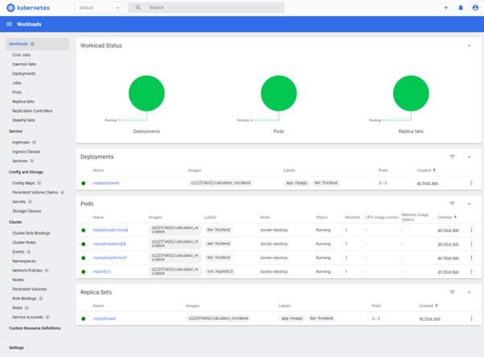

# SIT737-Task7.1P

## Github Repo

https://github.com/DaGoblin/737-2023-t1-prac7.1p.git

## Docker Image:

s222574652/calculator_ms

## DockerFile:

https://github.com/DaGoblin/737-2023-t1-prac7.1p/blob/main/CalculatorMS/dockerfile

## Kubernetes

Kubernetes setup files in github repo main directory.

Quick Video Showing interaction with Kubernetes Dashboard
https://www.youtube.com/watch?v=ARSpVwl2bms

### Setup Instructions

-   After Enabling Hyper-V (Windows) and enabling Kubernetes in Docker Desktop
-   Deploy Dashboard by running:
    -   kubectl apply -f https://raw.githubusercontent.com/kubernetes/dashboard/v2.7.0/aio/deploy/recommended.yaml

The following command have the corresponding yaml config file in the github main directory.

-   Create a new user using a user yaml config file
    -   kubectl apply –f admin-user.yaml
-   Create user role
    -   kubectl apply -f cluster_role_binding.yaml
-   Create Application POD
    -   kubectl apply -f createPod.yaml
-   Create Replica set
    -   kubectl apply -f createReplicaSet.yaml
-   Create Deployment
    -   kubectl apply -f .\createDeployment.yaml

### Login and view dashboard

-   Start the dashboard with:
    -   kubectl proxy
-   Use this url to access the dashboard:
    -   http://localhost:8001/api/v1/namespaces/kubernetes-dashboard/services/https:kubernetes-dashboard:/proxy
-   Retrieve bearer token with the following command:
    -   kubectl -n kubernetes-dashboard create token admin-user

-   Past the token to login
-   Dashboard will be displayed showing the pod running and three replicas.

